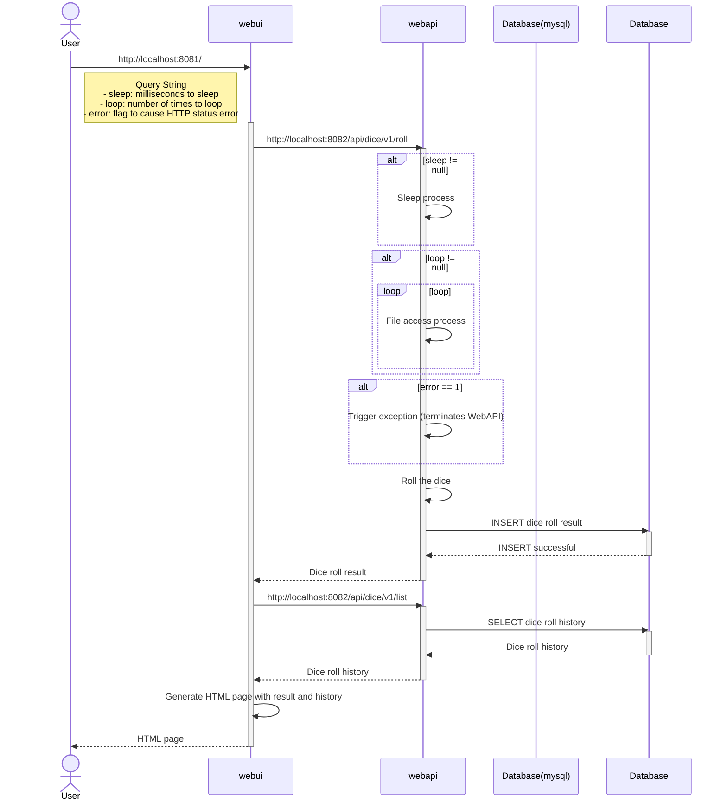

# ハンズオン用 Rolling dice Web アプリケーション

DevOps（CI/CD、オブザーバビリティー）をはじめとする各種ハンズオンでアプリケーションレイヤーで利用する Web アプリケーションです。

## Web アプリケーション構成

Web アプリケーションを構成する各コンポーネントの関係性をシーケンス図で示します。



## ソースコード改良手順

機能変更やバグ修正などでソースコードを改良したくなった場合の手順を案内します。

### Web アプリケーションの起動

リポジトリのルートディレクトリでスクリプトを実行して、各コンポーネントの実態となる全てのコンテナを起動します。

```
$ ./CREATE_CONTAINER.sh
```

スクリプトが終了したら全てのコンテナが起動したことを確認します。

```
$ ./CREATE_CONTAINER.sh list

### START: Show a list of container ##########
CONTAINER ID   IMAGE                  COMMAND                   CREATED         STATUS         PORTS                                                    NAMES
5e0830f1e459   webapp/webui:latest    "/__cacert_entrypoin…"   4 minutes ago   Up 4 minutes   0.0.0.0:8181->8181/tcp, [::]:8181->8181/tcp              webapp-webui
5615dbcbecb6   webapp/webapi:latest   "/__cacert_entrypoin…"   4 minutes ago   Up 4 minutes   0.0.0.0:8182->8182/tcp, [::]:8182->8182/tcp              webapp-webapi
f6f425edf34c   mysql:8.0              "docker-entrypoint.s…"   4 minutes ago   Up 4 minutes   0.0.0.0:3306->3306/tcp, [::]:3306->3306/tcp, 33060/tcp   webapp-mysql
```
```
$ ./CREATE_CONTAINER.sh info

/************************************************************
 * Information:
 * - Access to Monitored servers with the URL below.
 *   - webui:      http://localhost:8181
 *   - webapi:     http://localhost:8182/api/dice/v1/roll
 *   - webapi:     http://localhost:8182/api/dice/v1/list
 *   - micrometer: http://localhost:8181/actuator for webui
 *   - micrometer: http://localhost:8182/actuator for webapi
 ***********************************************************/
```

### 改良対象のコンポーネントを停止

docker コマンドで改良対象のコンテナを停止します。手順では webapi を改良するケースを示しますが、webui を改良する場合は、webapi を webui に差し替えます。

```
$ cd webapi/
$ docker stop webapp-webapi
```

### ソースコードを改良

機能を改良したいソースコードを改良します。コマンド例では「WebApiServiceImpl.java」を改良しています。
```
$ vim src/main/java/jp/sios/apisl/handson/rollingdice/webapp/webapi/service/WebApiServiceImpl.java
```

ビルドして構文エラーが無いことを確認します。
```
$ ./gradlew assemble
 :
BUILD SUCCESSFUL in 33s
6 actionable tasks: 5 executed, 1 from cache
Configuration cache entry stored.
```

### 改良したコンポーネントを起動

用意してある起動用スクリプトを使って起動します。
```
$ ./RUN.sh
 :
Test URL:
- http://localhost:8182/api/dice/v1/roll
- http://localhost:8182/api/dice/v1/list
 :
> Task :bootRun

  .   ____          _            __ _ _
 /\\ / ___'_ __ _ _(_)_ __  __ _ \ \ \ \
( ( )\___ | '_ | '_| | '_ \/ _` | \ \ \ \
 \\/  ___)| |_)| | | | | || (_| |  ) ) ) )
  '  |____| .__|_| |_|_| |_\__, | / / / /
 =========|_|==============|___/=/_/_/_/
 :
> IDLE
> :bootRun
```

起動用スクリプト実行直後に表示される URL へアクセスして動作を確認します。確認が終了したら [ctrl] + [c] で終了します。


### 改良したコンポーネントをコンテナで再起動

ルートディレクトリに戻り、改良したコンポーネントをリビルドして起動しなおします。

```
$ cd ..
$ ./CREATE_CONTAINER.sh rebuild webapp-webapi
```


