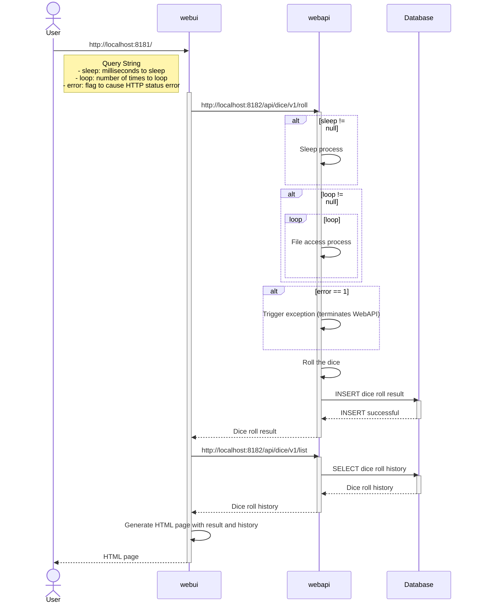

# Rolling Dice Web Application for Hands-on workshops

This is a web application used at the application layer for various hands-on workshops, including DevOps (CI/CD, Observability).

## Prerequisites

To run this application in your local environment, you must have the following tools installed.

- **Git**
  - Used to clone the repository.
- **Docker / Docker Desktop**
  - Required to run and manage application containers, including `mysql`.
- **Java (JDK)** (e.g., 17 or higher)
  - Needed to build `webui` and `webapi`, and to run them locally.
- **Web Browser or curl**
  - Used to check the operation of `webui` and `webapi`.
- **Text Editor**
  - Used to modify and edit source code (e.g., Visual Studio Code, IntelliJ IDEA, Vim, etc.).

## Technology Stack

This web application consists of the following technology stack.

### 🖥️ webui (Presentation Layer)

A front-end web application that users access via a browser. It calls the `webapi` and renders the results as HTML.

- **Language**: Java
- **Framework**: Spring Boot
- **Key Libraries**:
  - Spring Web (Web application features)
  - Thymeleaf (Template engine)
  - Spring Boot Actuator (Observability endpoints)

### ⚙️ webapi (Application Layer)

A back-end REST API called by `webui`. It handles business logic (rolling the dice, managing history).

- **Language**: Java
- **Framework**: Spring Boot
- **Key Libraries**:
  - Spring Web (REST API features)
  - Spring Data JPA (Database access)
  - Spring Boot Actuator (Observability endpoints)
  - MySQL Connector (DB driver)

### 🗄️ Database (Data Layer)

Persists the dice roll history processed by the `webapi`.

- **Database**: MySQL (8.0)

### 🛠️ Build & Runtime Environment

Builds these components and runs them as containers.

- **Build Tool**: Gradle
- **Container**: Docker
- **Utility**: Shell Script (For automating various operations)

## Web Application Architecture

### Sequence Diagram

The sequence diagram below shows the relationships between the components of this web application.



### Project Initialization

The application skeletons for both WebUI and WebAPI were generated using [Spring Initializr](https://start.spring.io/) with the following configurations:

#### Spring Initializr Settings

| Item | webapp-webui | webapp-webapi |
| :--- | :--- | :--- |
| **Project** | Gradle - Groovy | Gradle - Groovy |
| **Language** | Java | Java |
| **Spring Boot** | 3.4.3 | 3.4.3 |
| **Group** | jp.sios | jp.sios |
| **Artifact** | apisl.handson.grafana.webapp.webui | apisl.handson.grafana.webapp.webapi |
| **Packaging** | Jar | Jar |
| **Java** | 21 | 21 |
| **Dependencies** | Spring Web<br>Spring Boot DevTools<br>OTLP for metrics<br>Spring Boot Actuator<br>Thymeleaf | Spring Web<br>Spring Boot DevTools<br>OTLP for metrics<br>Spring Boot Actuator<br>MySQL Driver<br>JDBC API |

#### Additional Libraries

In addition to the dependencies configured via Spring Initializr, the following Java libraries are manually added to `build.gradle`:

**Common (webapp-webui & webapp-webapi):**

* `implementation 'org.springframework.boot:spring-boot-starter-actuator'`
    * Exposes health check endpoints at `http://{spring-boot:port}/actuator` for metrics.
* `runtimeOnly 'io.micrometer:micrometer-registry-otlp'`
    * Enables sending metrics via OTLP through Micrometer.
* `runtimeOnly 'io.micrometer:micrometer-registry-prometheus'`
    * Enables scraping metrics via Prometheus through Micrometer.
* `implementation 'io.micrometer:micrometer-tracing-bridge-otel'`
    * Enables Exemplars to attach Trace IDs and Span IDs to `http_server_requests_seconds_bucket` metrics.
* `implementation 'io.opentelemetry.instrumentation:opentelemetry-spring-boot-starter'`
    * Enables sending logs and traces via OTLP.

**webapp-webui only:**

* `implementation 'org.json:json'`
    * Used to parse JSON strings and handle them as objects.

**webapp-webapi only:**

* `implementation 'org.springdoc:springdoc-openapi-starter-webmvc-ui'`
    * Generates documentation in OpenAPI specification format directly from the source code.

## How to Modify the Source Code

This section guides you through the steps to modify the source code for feature changes or bug fixes.

### Start the Web Application

Run the script in the root directory of the repository to start all containers for each component.

```
$ ./CREATE_CONTAINER.sh
```

After the script finishes, verify that all containers are running.

```
$ ./CREATE_CONTAINER.sh list

### START: Show a list of container ##########
CONTAINER ID   IMAGE                  COMMAND                   CREATED         STATUS         PORTS                                                    NAMES
5e0830f1e459   webapp/webui:latest    "/__cacert_entrypoin…"   4 minutes ago   Up 4 minutes   0.0.0.0:8181->8181/tcp, [::]:8181->8181/tcp              webapp-webui
5615dbcbecb6   webapp/webapi:latest   "/__cacert_entrypoin…"   4 minutes ago   Up 4 minutes   0.0.0.0:8182->8182/tcp, [::]:8182->8182/tcp              webapp-webapi
f6f425edf34c   mysql:8.0              "docker-entrypoint.s…"   4 minutes ago   Up 4 minutes   0.0.0.0:3306->3306/tcp, [::]:3306->3306/tcp, 33060/tcp   webapp-mysql
```
```
$ ./CREATE_CONTAINER.sh info

/************************************************************
 * Information:
 * - Access to Monitored servers with the URL below.
 *   - webui:      http://localhost:8181
 *   - webapi:     http://localhost:8182/api/dice/v1/roll
 *   - webapi:     http://localhost:8182/api/dice/v1/list
 *   - micrometer: http://localhost:8181/actuator for webui
 *   - micrometer: http://localhost:8182/actuator for webapi
 ***********************************************************/
```

### Stop the Target Component

Stop the container you want to modify using the `docker stop` command. This example shows how to modify `webapi`. If you want to modify `webui`, replace `webapp-webapi` with `webapp-webui`.

```
$ cd webapi/
$ docker stop webapp-webapi
```

### Modify the Source Code

Modify the source code you want to improve. The command example shows modifying "WebApiServiceImpl.java".

```
$ vim src/main/java/jp/sios/apisl/handson/rollingdice/webapp/webapi/service/WebApiServiceImpl.java
```

Build the code to confirm there are no syntax errors.

```
$ ./gradlew assemble -x cyclonedxBom
 :
BUILD SUCCESSFUL in 33s
6 actionable tasks: 5 executed, 1 from cache
Configuration cache entry stored.
```

### Verify the Changes

Run the unit tests to ensure the changes work correctly.

```
$ ./gradlew test -x cyclonedxBom
 :
BUILD SUCCESSFUL in 533ms
4 actionable tasks: 4 up-to-date
Configuration cache entry reused.

```

### Run the Modified Component

Use the provided startup script to run it locally.

```
$ ./RUN.sh
 :
Test URL:
- http://localhost:8182/api/dice/v1/roll
- http://localhost:8182/api/dice/v1/list
 :
> Task :bootRun

  .   ____          _            __ _ _
 /\\ / ___'_ __ _ _(_)_ __  __ _ \ \ \ \
( ( )\___ | '_ | '_| | '_ \/ _` | \ \ \ \
 \\/  ___)| |_)| | | | | || (_| |  ) ) ) )
  '  |____| .__|_| |_|_| |_\__, | / / / /
 =========|_|==============|___/=/_/_/_/
 :
> IDLE
> :bootRun
```

Access the URL displayed immediately after running the script to verify its behavior. Press [Ctrl] + [C] to stop when finished.

### Restart the Modified Component as a Container

Return to the root directory, rebuild the modified component, and restart it.

```
$ cd ..
$ ./CREATE_CONTAINER.sh rebuild webapp-webapi
```
